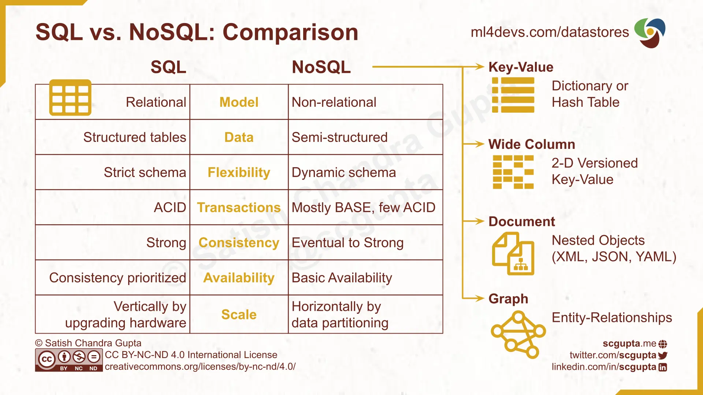

# MongoDB

## What is MongoDB?

- MongoDB is a document database used to build highly available and scalable internet applications.

## What are NoSQL Databases?

- NoSQL is an approach to database management that can accommodate a wide variety of data models, including key-value, document, columnar and graph formats.

## Why is MongoDB popular?

- Has flexible data storage.
- Scalable to adjust to user demands.
- Many deployment options in any cloud such as AWS, Azure and GCP.
- Easy and fast to install.
- Great for teams using agile methodoligies.

## What is seed in MongoDB?

- Seeding a database is a process in which an initial set of data is provided to a database when it is being installed.
- Mongo databases need to be seeded to allow for:
   - Testing and Development - Saves time having to enter data manually.
   - Creates a consistent environment for development team.
   - Ensures data integrity by keeping it consistent. This helps prevent errors in the application.

## What port does MongoDB use?

- 27017